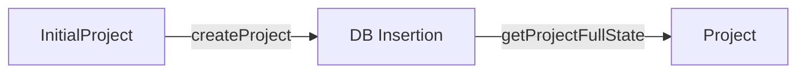

# State Management & Persistence

## Overview

State management in Cinematic Canvas is built on three pillars:
1.  **Strict Project State**: Defining the valid lifecycle of a project.
2.  **Persistent Workflow State**: Using LangGraph checkpoints for execution resilience.
3.  **Temporal State**: Tracking narrative continuity (injuries, weather) across scenes.

## 1. Project State Machine

The project lifecycle moves strictly from a "Loose" creation state to a "Strict" runtime state.



### InitialProject (Creation)
*   **Purpose**: Flexible input for creating new projects.
*   **Characteristics**: Optional metadata, empty storyboards allowed.
*   **Schema**: `InitialProjectSchema`.

### Project (Runtime)
*   **Purpose**: The authoritative source for Application Logic (Agents, Workflow).
*   **Characteristics**: Strict, fully validated, no missing core data.
*   **Guarantee**: Functions receiving `Project` need no defensive null checks.

## 2. Repository Architecture

The `ProjectRepository` manages the persistence of these states using **Drizzle ORM** and **PostgreSQL**.

### Key Principles

1.  **Strict Contracts**:
    *   **Inputs**: Accepts `InitialProject`.
    *   **Outputs**: **ALWAYS** returns a validated `Project`. Throws if DB state is invalid.

2.  **Separation of Concerns**:
    *   **DB Entities**: Flat, relational (SQL-like).
    *   **Domain Models**: Rich, nested (App-like).
    *   The Repository handles the mapping between these two worlds.

3.  **Efficient Consistency**:
    *   **Sorted Locking**: Prevents deadlocks by sorting IDs before acquiring row locks.
    *   **Atomic Transactions**: Updates to Scenes, Characters, and Junction tables happen in single transactions.

## 3. Persistent Workflow State (Checkpoints)

The **Runtime Execution State** is managed via **PostgreSQL Checkpoints** (powered by LangGraph).

*   **State**: Saved after every significant step.
*   **Resumability**: If a worker crashes, the pipeline resumes from the last checkpoint.
*   **Versioning**: Attempt numbers (e.g., `scene_01_v3.mp4`) are tracked in the state to ensure uniqueness.

## 4. Temporal State & Continuity

The framework includes a comprehensive **Temporal State Tracking System** that monitors and evolves character and location states throughout the story progression.

**Key Principle**: *Every change persists until the narrative provides a reason for it to revert.*

### Architecture

1.  **State Evolution Engine** (`pipeline/agents/state-evolution.ts`): Analyzes scene descriptions using heuristic-based parsers to update state objects (e.g., "runs through mud" → increases `dirtLevel`).
2.  **Continuity Manager**: Initializes baseline states and calls evolution logic after each scene generation.
3.  **Prompt Composer**: Injects current state into generation prompts.

### Character State Tracking
*   **Physical Condition**: Injuries (type, location, severity), Exhaustion, Sweat.
*   **Appearance**: Dirt Level, Costume Condition (tears, stains, wetness), Hair state.
*   **Spatial & Emotional**: Position, Exit Direction, Emotional Arc.

### Location State Tracking
*   **Environment**: Time of Day, Weather (intensity, precipitation), Ground Condition.
*   **Object Persistence**: Broken objects (e.g., shattered windows) remain broken.
*   **Atmospheric Effects**: Smoke, fog, or dust clouds can linger.

### Usage in Prompts
When generating a scene, the system injects a specialized block into the prompt:

```text
CHARACTER: John Smith
CURRENT STATE (MUST MAINTAIN):
  - Injuries: cut on arm (minor)
  - Dirt Level: dirty
  - Costume Tears: sleeve torn

LOCATION CURRENT STATE (MUST MAINTAIN):
  - Weather: Rain
  - Ground: wet
  - Broken Objects: window shattered
```
