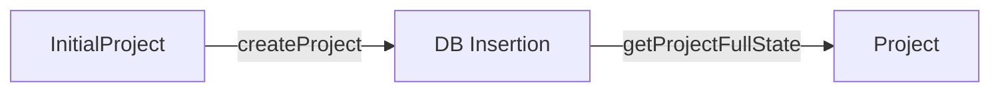

# State Management & Repository

## Overview

State management in Cinematic Canvas is built on two pillars: **Strict State Transitions** for the project lifecycle and a **Refactored Repository** pattern for database interactions.

## 1. Project State Machine

The project lifecycle moves strictly from a "Loose" creation state to a "Strict" runtime state.



### InitialProject (Creation)
*   **Purpose**: Flexible input for creating new projects.
*   **Characteristics**: Optional metadata, empty storyboards allowed.
*   **Schema**: `InitialProjectSchema`.

### Project (Runtime)
*   **Purpose**: The authoritative source for Application Logic (Agents, Workflow).
*   **Characteristics**: strict, fully validated, no missing core data.
*   **Guarantee**: Functions receiving `Project` needs no defensive null checks.

---

## 2. Repository Architecture

The `ProjectRepository` manages the persistence of these states using **Drizzle ORM** and **PostgreSQL**.

### Key Principles

1.  **Strict Contracts**:
    *   **Inputs**: Accepts `InitialProject`.
    *   **Outputs**: **ALWAYS** returns a validated `Project`. Throws if DB state is invalid.

2.  **Separation of Concerns**:
    *   **DB Entities**: Flat, relational (SQL-like).
    *   **Domain Models**: Rich, nested (App-like).
    *   The Repository handles the mapping between these two worlds.

3.  **Efficient Consistency**:
    *   **Sorted Locking**: Prevents deadlocks by sorting IDs before acquiring row locks.
    *   **Atomic Transactions**: Updates to Scenes, Characters, and Junction tables happen in single transactions.

### Asset Management

Assets (images, videos) are managed uniformly across all entities:

```typescript
// Unified API
await repo.updateAssets('scene', id, key, value);
await repo.updateAssets('character', id, key, value);
```

This abstraction handles the underlying JSONB storage logic, keeping the domain code clean.

## 3. Persistent Workflow State (Checkpoints)

Beyond the static project data, the **Runtime Execution State** is managed via **PostgreSQL Checkpoints** (powered by LangGraph).

*   **State**: Saved after every significant step.
*   **Resumability**: If a worker crashes, the pipeline resumes from the last checkpoint.
*   **Versioning**: Attempt numbers (e.g., `scene_01_v3.mp4`) are tracked in the state to ensure uniqueness.
