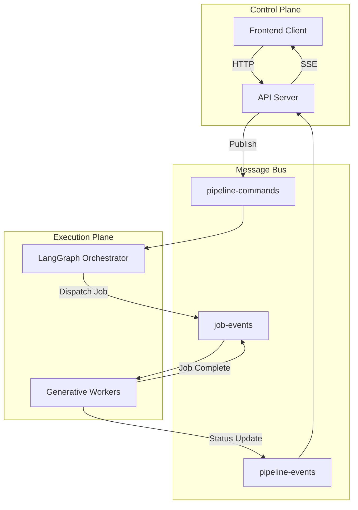

# Workflow Orchestration

## Overview

The workflow execution is **distributed, event-driven, and persistent**. It decouples the Control Plane (Server) from the Execution Plane (Workers) using **Google Cloud Pub/Sub**.

## Architecture Diagram

## Pub/Sub Topics

1.  **`pipeline-commands`**: Control signals (`START`, `STOP`, `RETRY`, `REGENERATE`).
    *   *Source*: Server.
    *   *Dest*: Pipeline Worker.

2.  **`video-events` / `job-events`**: Internal coordination.
    *   *Source*: Pipeline (Dispatcher) & Worker (Executor).
    *   *Dest*: Pipeline (State Updater).

3.  **`pipeline-events`**: User-facing status.
    *   *Source*: All services.
    *   *Dest*: Server (for SSE forwarding).

4.  **`pipeline-cancellations`**: Emergency broadcast.
    *   *Source*: Server.
    *   *Dest*: All Workers (abort immediately).

---

## Command-Driven Model

Execution is managed by explicit commands:

| Command | Description |
| :--- | :--- |
| **`START_PIPELINE`** | Initiates new run or resumes from checkpoint. |
| **`STOP_PIPELINE`** | Gracefully halts processing and checkpoints state. |
| **`REGENERATE_SCENE`** | Rewinds state to a specific scene and restarts generation. |
| **`RESOLVE_INTERVENTION`** | Provides human input for a paused/failed step (Human-in-the-Loop). |

## Integration with Roles

The workflow integrates [Role-Based Prompts](./prompt-engineering.md) at every generation step:

1.  **Storyboard**: `Director` + `Cinematographer` enrich the script.
2.  **Asset Gen**: `Costume` & `ProdDesigner` create usage references.
3.  **Scene Gen**: All roles feed into the **Meta-Prompt** for video generation.

State is strictly checkpointed to PostgreSQL between these steps, ensuring that if a generation fails, we can retry just that step without losing the accumulated context.
