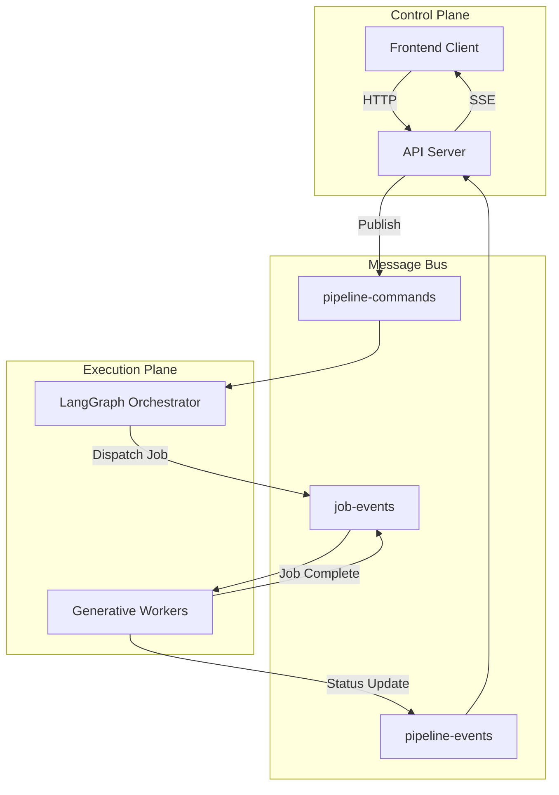

# Workflow Orchestration

## Overview

The workflow execution is **distributed, event-driven, and persistent**. It decouples the Control Plane (Server) from the Execution Plane (Workers) using **Google Cloud Pub/Sub**.

## Architecture Diagram



## Pub/Sub Topics

1.  **`pipeline-commands`**: Control signals (`START`, `STOP`, `RETRY`, `REGENERATE`).
    *   *Source*: Server.
    *   *Dest*: Pipeline Worker.

2.  **`video-events` / `job-events`**: Internal coordination.
    *   *Source*: Pipeline (Dispatcher) & Worker (Executor).
    *   *Dest*: Pipeline (State Updater).

3.  **`pipeline-events`**: User-facing status.
    *   *Source*: All services.
    *   *Dest*: Server (for SSE forwarding).

4.  **`pipeline-cancellations`**: Emergency broadcast.
    *   *Source*: Server.
    *   *Dest*: All Workers (abort immediately).

---

## Command-Driven Model

Execution is managed by explicit commands:

| Command | Description |
| :--- | :--- |
| **`START_PIPELINE`** | Initiates new run or resumes from checkpoint. |
| **`STOP_PIPELINE`** | Gracefully halts processing and checkpoints state. |
| **`REGENERATE_SCENE`** | Rewinds state to a specific scene and restarts generation. |
| **`RESOLVE_INTERVENTION`** | Provides human input for a paused/failed step (Human-in-the-Loop). Includes `jobType` for targeted retry of specific job types (e.g., GENERATE_SCENE_VIDEO creates new job with revised prompt). |

## Integration with Roles

The workflow integrates [Role-Based Prompts](./prompt-engineering.md) at every generation step:

1.  **Storyboard**: `Director` + `Cinematographer` enrich the script.
2.  **Asset Gen**: `Costume` & `ProdDesigner` create usage references.
State is strictly checkpointed to PostgreSQL between these steps, ensuring that if a generation fails, we can retry just that step without losing the accumulated context.

---

## Job Recovery & Intervention

Jobs can fail for different reasons, and the system handles each differently:

### Job States

| State | Description |
| :--- | :--- |
| `PENDING` | Created, waiting for worker to claim |
| `RUNNING` | Worker is actively executing |
| `COMPLETED` | Success - terminal state |
| `FAILED` | Retriable failure (e.g., transient API error) |
| `FATAL` | Non-retriable failure requiring intervention |
| `CANCELLED` | User or system cancelled |

### Recovery Context

When a job reaches `FATAL` state, the `recoveryContext` field provides details:

```typescript
recoveryContext: {
    reason: "RETRY_EXHAUSTED" | "PERMANENT_ERROR" | "MANUAL_RESET",
    triggeredBy: "MONITOR" | "DISPATCHER" | "USER",
    previousJobId: string  // The FATAL job this one replaces
}
```

| Reason | Description | Behavior |
| :--- | :--- | :--- |
| `RETRY_EXHAUSTED` | Max retries reached | Dispatcher auto-creates successor job |
| `PERMANENT_ERROR` | RAI/Safety or permanent failure | Emit intervention event, wait for human input |
| `MANUAL_RESET` | User cleared FATAL state | Allow manual retry |

### RAI Safety Errors

When a worker detects a Responsible AI (RAI) safety error (content policy violation), it:
1.  Marks the job as `FATAL` with `recoveryContext.reason = "PERMANENT_ERROR"`
2.  Emits `JOB_FAILED` event
3.  The pipeline emits `LLM_INTERVENTION_NEEDED` to the client

The user can then modify their prompt and retry. If the job type is `GENERATE_SCENE_VIDEO`, the pipeline creates a **new job** with the revised prompt (rather than resuming the entire workflow), ensuring only the failed scene is regenerated.
