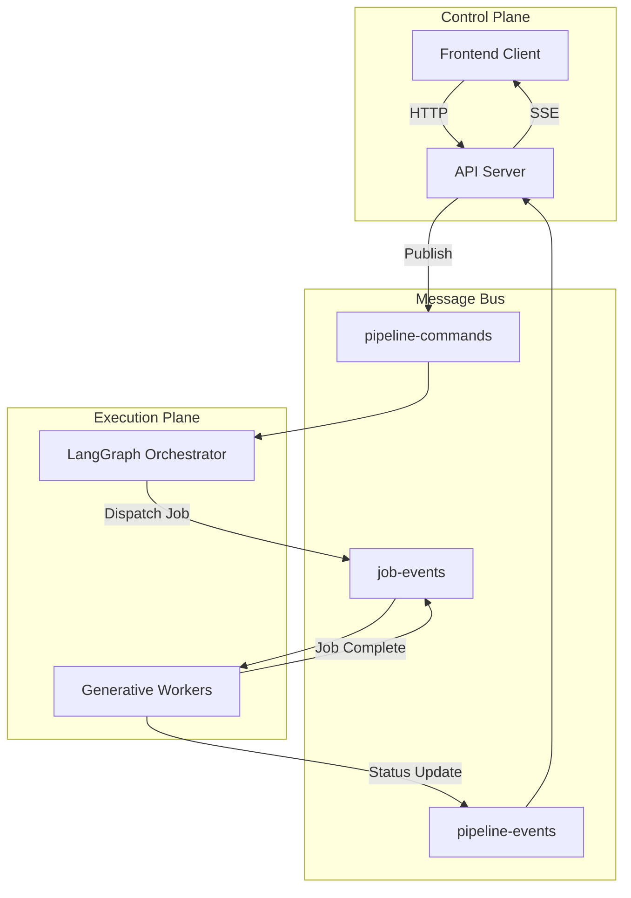

# Workflow Orchestration

## Overview

The workflow execution is **distributed, event-driven, and persistent**. It decouples the Control Plane (Server) from the Execution Plane (Workers) using **Google Cloud Pub/Sub**.

The system treats video generation not as a linear script, but as a state machine where:
*   **State** is the "Project" (storyboard, assets, progress).
*   **Events** are "Commands" (Start, Stop, Regenerate).
*   **Transitions** are handled by the **Pipeline Worker** using LangGraph.

## Architecture Diagram

## Pub/Sub Topics

1.  **`pipeline-commands`**: Control signals (`START`, `STOP`, `RETRY`, `REGENERATE`).
    *   *Source*: Server.
    *   *Dest*: Pipeline Worker.
2.  **`job-events`** (also known as `video-events`): Internal coordination.
    *   *Source*: Pipeline (Dispatcher) & Worker (Executor).
    *   *Dest*: Pipeline (State Updater).
3.  **`pipeline-events`**: User-facing status.
    *   *Source*: All services.
    *   *Dest*: Server (for SSE forwarding).
4.  **`pipeline-cancellations`**: Emergency broadcast.
    *   *Source*: Server.
    *   *Dest*: All Workers (abort immediately).

## Command-Driven Model

Execution is managed by explicit commands rather than direct API calls to workers. This allows for asynchronous processing and robust failure recovery.

| Command | Description |
| :--- | :--- |
| **`START_PIPELINE`** | Initiates a new run or resumes from a checkpoint. |
| **`STOP_PIPELINE`** | Gracefully halts processing and checkpoints state. |
| **`REGENERATE_SCENE`** | Rewinds state to a specific scene and restarts generation. |
| **`RESOLVE_INTERVENTION`** | Provides human input for a paused/failed step (Human-in-the-Loop). |
| **`GENERATE_SCENE_FRAMES`** | Generates specific frames for a scene without running full flow. |

## Job Plane & Fan-Out/Fan-In

The Job Plane is a transactional layer inside the Pipeline that manages the lifecycle of asynchronous tasks.

### Job State Machine
| State | Transitions | Description |
| :--- | :--- | :--- |
| `CREATED` | `RUNNING` | Job registered in DB, waiting for worker. |
| `RUNNING` | `COMPLETED`, `FAILED` | Worker has picked up the job. |
| `COMPLETED` | *Terminal* | Task finished successfully. |
| `FAILED` | *Terminal* | Task failed after retries. |
| `CANCELLED` | *Terminal* | User or system cancelled the job. |

### Fan-Out / Fan-In Pattern
1.  **Fan-Out**: When a workflow node needs to perform work (e.g., "Generate 5 Scenes"), it declares **all required jobs upfront**. It emits `CREATE_JOB` commands and records the job IDs.
2.  **Fan-In**: The workflow node pauses (checkpoints) and waits. It only advances when `completedJobs ⊇ requiredJobs`.

## Transient State vs. Persistent State

We separate **Persistent Entities** (what stays in the DB) from **Application/Transient State** (what lives in the message broker or memory).

*   **Persistent (DB)**: Everything that defines the "Studio" state—Project history, Scene specifications, Character continuity states, and Asset URLs.
*   **Transient (PubSub/Memory)**: Immediate feedback like `SceneProgressEvent`, `InterruptValue`, and raw socket commands. These are validated via Zod but never hit a primary DB table unless they fail and are logged to WorkflowState.
