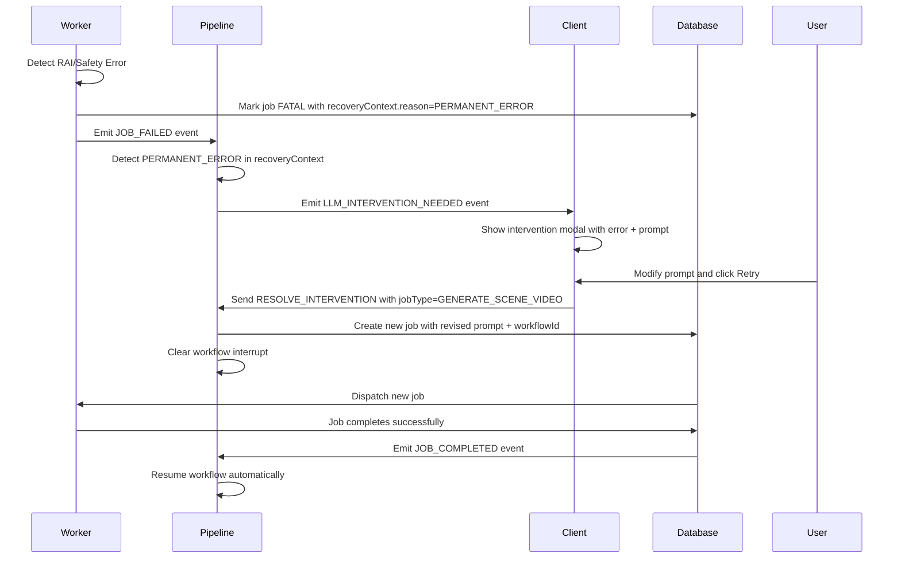

# Reliability & Quality

## Overview

Cinematic Canvas uses a multi-layered approach to ensure high-quality generation and system reliability. This includes a **Human-in-the-Loop Retry Architecture**, **Automated Quality Evaluation**, and **Domain-Specific Generation Rules**.

## 1. Automated Quality Evaluation

Every generated asset (frame, scene, video) undergoes automated scrutiny by a dedicated **Quality Control Agent**.

### Evaluation Criteria
The agent evaluates content against five dimensions:
1.  **Narrative Fidelity**: Does it match the script?
2.  **Character Consistency**: Do characters look like their reference images?
3.  **Technical Quality**: Is the image sharp, well-lit, and artifact-free?
4.  **Emotional Authenticity**: Does the mood match the scene?
5.  **Continuity**: Does it match the previous shot?

### Issue Grading
*   **CRITICAL**: Unusable (e.g., character warping, semantic misunderstanding).
*   **MAJOR**: Significant defects (e.g., wrong character count).
*   **MINOR**: Acceptable with tweaks (e.g., slight background mismatch).

## 2. Adaptive Retry Mechanism

When quality issues are detected, the system does **not** simply retry blindly. It attempts to **fix the prompt** based on the specific failure.

### The Correction Loop
1.  **Analyze**: The Quality Agent identifies *why* the generation failed (e.g., "Missing Character B").
2.  **Construct**: A new, more explicit prompt is created (e.g., "Add Character B to the left foreground").
3.  **Constraint**: Negative constraints are added to prevent repeating the error.
4.  **Retry**: The generation is re-run with the improved prompt.

> **Note**: Retries are "additive". We add detail to clarify, rather than removing detail which might lose context.

## 3. Human-in-the-Loop Control (`retryLlmCall`)

For critical AI operations, we use a `retryLlmCall` utility that integrates with **LangGraph Interrupts**.

### How it works
If an LLM call fails (or triggers a safety filter), the workflow **pauses**.
1.  The failure is exposed as an **Interrupt**.
2.  A human operator (or the user via UI) can inspect the **Safety Parameters** (prompt, seed, model).
3.  The operator can **edit valid parameters** and `RESUME` the workflow.

This ensures that expensive or sensitive operations don't fail silently or burn budget on bad loops.

These rules are injected into the system prompt *before* generation begins, acting as guardrails for the model.

---

## 5. RAI Safety Error Intervention Flow

When a generation job fails due to **Responsible AI (RAI) safety guidelines** (content policy violations, safety filters), the system enters a special intervention flow rather than blindly retrying.

### Why Special Handling?

RAI errors indicate that the content violates the upstream model's usage policies. Blindly retrying the same prompt will:
1.  Fail repeatedly with the same error
2.  Waste API quota and compute resources
3.  Risk rate limiting or temporary bans from the upstream provider

### The Intervention Flow

### Key Implementation Details

1.  **Worker Detection**: When a job fails with an RAI error, the worker marks it as `FATAL` with `recoveryContext.reason = "PERMANENT_ERROR"`.

2.  **Pipeline Emission**: The pipeline listens for `JOB_FAILED` events and checks the `recoveryContext`. If `reason === "PERMANENT_ERROR"`, it emits `LLM_INTERVENTION_NEEDED` with the job type.

3.  **Targeted Retry**: When the user resolves the intervention:
    *   If `jobType === "GENERATE_SCENE_VIDEO"`, the pipeline creates a **new job** with the user's revised prompt
    *   The job includes `workflowId` so the workflow resumes automatically when the job completes
    *   Only the failed scene is regenerated—not the entire workflow

4.  **Resume vs New Job**: Other job types use the standard `resolveIntervention` flow which resumes the workflow from its checkpoint, allowing the workflow to regenerate only the affected steps.

### Recovery Context

The `recoveryContext` field on jobs provides visibility into why a job failed and how it should be handled:

| Reason | Triggered By | Behavior |
| :--- | :--- | :--- |
| `RETRY_EXHAUSTED` | Dispatcher | Auto-create successor job with same parameters |
| `PERMANENT_ERROR` | Worker | Block auto-retry, emit intervention event |
| `MANUAL_RESET` | User | Clear FATAL state for manual retry |
