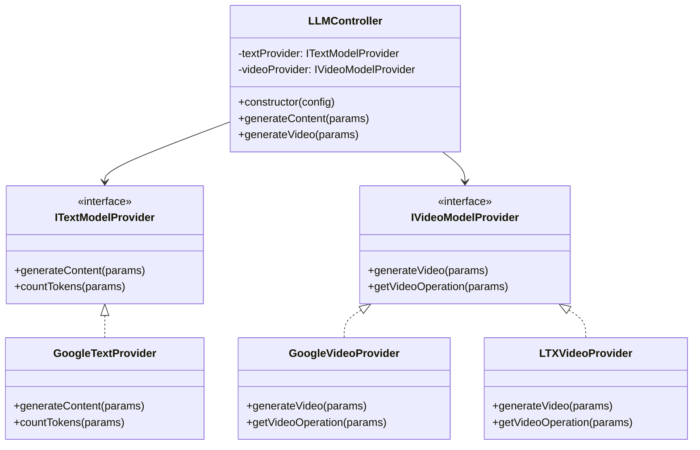

# LLM Provider Architecture Refactor Plan

## Overview

This plan outlines the refactoring of the LLM provider system to support distinct Text and Video model providers. The goal is to separate concerns and allow for flexible configuration of providers (e.g., using Google for text and LTX for video).

## Architecture

We will implement a clean separation of interfaces for Text and Video generation.

### Class Diagram

## Detailed Steps

### 1. Define Interfaces

Update `pipeline/llm/provider-types.ts` to export `ITextModelProvider` and `IVideoModelProvider`. These interfaces will define the contract for text and video generation, decoupling the controller from specific implementations.

### 2. Implement Google Providers

- **Text**: Create `pipeline/llm/google/text-provider.ts`. This will encapsulate the Google GenAI text generation logic.
- **Video**: Create `pipeline/llm/google/video-provider.ts`. This will encapsulate the Google GenAI video generation logic.
- *Cleanup*: The existing `pipeline/llm/google/provider.ts` can be deprecated or refactored to use these new classes if needed, but likely we will replace it or have the controller use the new classes directly.

### 3. Implement LTX Video Provider

Create `pipeline/llm/ltx/video-provider.ts`. This class will implement `IVideoModelProvider` and handle communication with the custom LTX endpoint. It will need to handle parameter mapping from a common format (or a flexible input type) to the LTX API specific JSON structure.

### 4. Refactor LLMController

Update `pipeline/llm/controller.ts` to:

- Accept configuration for which text and video provider to use.
- Instantiate the appropriate provider classes.
- Delegate calls to the respective provider instances.

## Configuration

The system will likely use environment variables to determine which provider to use:

- `LLM_TEXT_PROVIDER`: e.g., "google"
- `LLM_VIDEO_PROVIDER`: e.g., "google" or "ltx"
